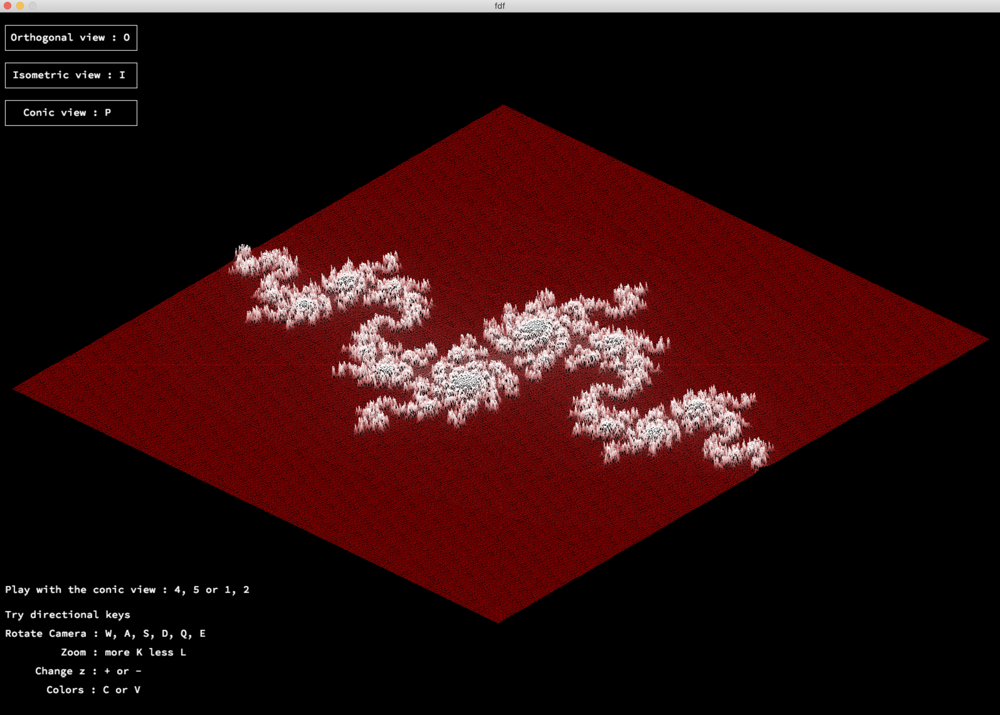

Fdf est un programme permettant de représenter en relief une map donnée (voir ci-dessous le format de la map) afin de modéliser un terrain en 3d. Pour l'approfondir, j'ai aussi implémenter les rotations de matrix 2d, récupérer les couleurs dans la map et changer la variation de couleur selon la hauteur du z.

Contraintes:
- Langage C
- fonctions autorisées : open, read, write, close, malloc, free, perror, strerror, exit, toutes les fonctions de la lib math (-lm et man 3 math), toutes les fonctions de la miniLibX.
- Obligation de faire minimum 3 vues differentes (ici : isométrique, orthogonale et conic).

Lien youtube : https://www.youtube.com/watch?v=EOOILinZxWw&feature=youtu.be
